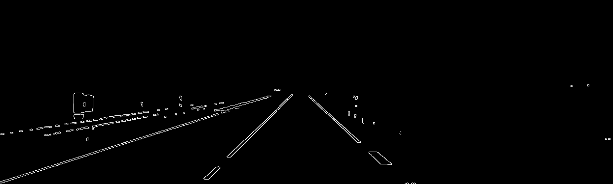
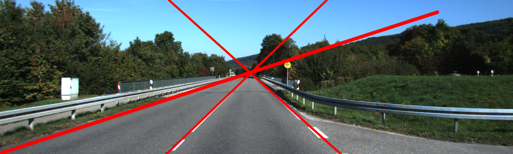
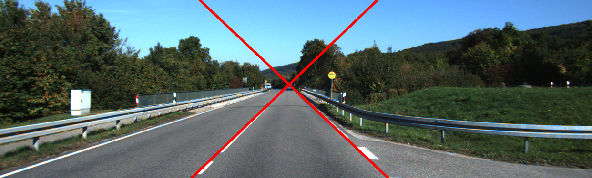
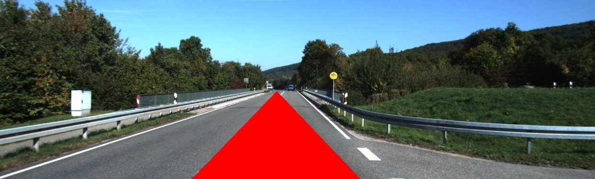

# lab4
> Name: Xu LingXiao 
> Student number: 2008500

## Task1
For task1, there's not much related to computer vision but there are some tricks for c++.
Since we should not use global variable, i create a `class` for task1. In task1, we need to use `track bar`, however, the callback of the `track bar` in OpenCV should be `static`. So we need to create a callback function which is `static` type and contains the "real" callback function in it:

```c++
// real callback function
void CannyThreshold() {
    blur( src_gray, detected_edges, Size(3,3) );
    Canny( detected_edges, detected_edges, lowThreshold, lowThreshold * ratio, kernel_size );
    dst = Scalar::all(0);
    src.copyTo( dst, detected_edges);
    imshow( window_name, dst );
}

// callback function
static void callback_(int, void* userdata) {
    Task1 *tmp = (Task1*)userdata;
    tmp->CannyThreshold(); 
}

// construction function
Task1() {
    ...
    createTrackbar( "Min Threshold:", window_name, &lowThreshold, max_lowThreshold, callback_, this);
    callback_(0, this);
    ...
}
```

## Task2
My idea is to remove the element that is not white in the picture(the white markings are always white, obviously ^_^). That is also what i do in task3.

## Task3
In task3 we need to detect white markings on the road by Hough transform. However, there are too many lines in the picture. So i decide to do some pre-operation. Since we only need white marking, so i remove all the element that is far from the color "white":

```c++
void colorThreshold(int T, Mat *src) {
    int row = src->rows;
    int col = src->cols;
    int r, g, b;
    for(int i = 0; i < row; i++) {
        for(int j = 0; j < col; j++) {
            Vec3b pixel = (*src).at<Vec3b>(Point (j, i));
            b = pixel[0];
            g = pixel[1];
            r = pixel[2];
    
            if(abs(b - 255) < T && abs(g - 255) < T && abs(r - 255) < T ) {
                (*src).at<Vec3b>(i, j) = Vec3b(255, 255, 255);
            } else {
                (*src).at<Vec3b>(i, j) = Vec3b(0, 0, 0);
            }
        }
    }
}
```

Then blur the image and use Canny to find out the edges:



Now it's easy to detect the **"white"** lines.

```c++
vector<Vec2f> lines;
HoughLines( dst, lines, 1, CV_PI / 90, 120, 0, 0 );
```


My team mate reminds me that we can set angles for `HoughLines`:

```c++
vector<Vec2f> line1;
HoughLines( dst, line1, 1, CV_PI / 90, 120, 0, 0 , 0.7, 0.9 );
vector<Vec2f> line2;
HoughLines( dst, line2, 1, CV_PI / 90, 120, 0, 0 , 2.26, 2.44);
```

By this way, i remove the first left white line.



For color the area between two lines, i just iterate the whole image and check the point, if the point is between the two lines, change its color to red.

```c++
float r1 = line1[0][0]; 
float theta1 = line1[0][1]
float r2 = line2[0][0];
float theta2 = line2[0][1]
for(int i = src.rows - 1; i >= 0; i--) {
    for(int j = 0; j < src.cols; j++) {
        if(j * sin(theta2) + i * cos(theta2) < abs(r2) && j * sin(theta1) + i * cos(theta1) > r1)
            src.at<Vec3b>(i, j) = Vec3b(0, 0, 255);
    }
}
```



## Task4
Task4 is to detect the circle in the image, just use `HoughCircles`.

```c++
HoughCircles(src_gray, circles, HOUGH_GRADIENT_ALT, 1.5, src_gray.rows / 16, 500, 0.8, 1, 30);
```

I choose `HOUGH_GRADIENT_ALT`, set the `minRadius` to `1` and the `maxRadius` to `30`.

